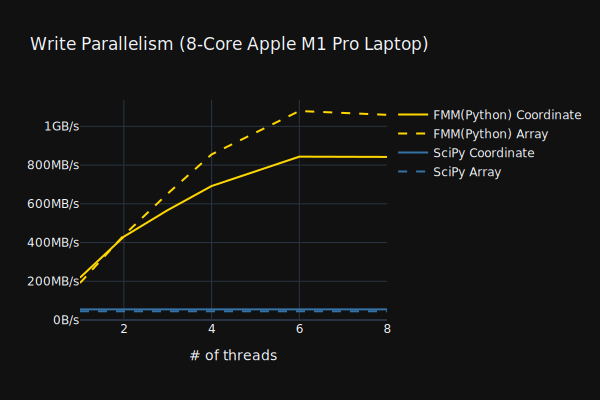

Fast and full-featured Matrix Market file I/O for Python.

Read and write any Matrix Market `.mtx` file into a Numpy array, a coordinate (triplet) sparse structure, or SciPy sparse matrix.

Implemented as a Python binding of the C++ [`fast_matrix_market` Matrix Market I/O library](https://github.com/alugowski/fast_matrix_market).

```shell
pip install fast_matrix_market
```

# Usage
```python
import fast_matrix_market as fmm

# SciPy-like
>>> a = fmm.mmread("eye3.mtx")
>>> a
<3x3 sparse matrix of type '<class 'numpy.float64'>'
        with 3 stored elements in COOrdinate format>
>>> print(a)
(0, 0)	1.0
(1, 1)	1.0
(2, 2)	1.0


# Coordinate/Triplet
>>> (data, (rows, cols)), shape = fmm.read_triplet("eye3.mtx")
>>> rows, cols, data
(array([0, 1, 2], dtype=int32), array([0, 1, 2], dtype=int32), array([1., 1., 1.]))


# Dense Array
>>> a = fmm.read_array("eye3.mtx")
>>> a
array([[1., 0., 0.],
       [0., 1., 0.],
       [0., 0., 1.]])


# Write to file
>>> fmm.mmwrite("matrix.mtx", a)


# Write to streams
>>> bio = io.BytesIO()
>>> fmm.mmwrite(bio, a)
```

To only read the header:
```python
>>> header = fmm.read_header("eye3.mtx")
header(shape=(3, 3), nnz=3, comment="3-by-3 identity matrix", object="matrix", format="coordinate", field="real", symmetry="general")
>>> header.shape
(3, 3)
>>> header.to_dict()
{'shape': (3, 3), 'nnz': 3, 'comment': '3-by-3 identity matrix', 'object': 'matrix', 'format': 'coordinate', 'field': 'real', 'symmetry': 'general'}
```


# Compared to `scipy.io.mmread`

`fast_matrix_market` includes `mmread()` and `mmwrite()` methods that are direct replacements for their respective SciPy versions.

Compared to SciPy version 1.10.0:

### Significant performance boost




All cores on the system are used by default, use the `parallelism` argument to override. SciPy's routines are single-threaded.

### 64-bit indices
`scipy.io.mmread()` crashes on large matrices (dimensions > 2<sup>31</sup>) because it uses 32-bit indices on most platforms.

`fast_matrix_market` switches to `int64` if the matrix dimensions require it.

### Directly write CSC/CSR matrices

`scipy.io.mmwrite` converts CSC and CSR matrices to COO first. `fast_matrix_market` can write them directly with no conversion.

### longdouble
Read and write `longdouble` values for more floating-point precision on platforms that support it (e.g. 80-bit floats).

Just pass `long_type=True` argument to any read method to use `longdouble` arrays. SciPy can write `longdouble` matrices but reads use `double` precision.

**Note:** On many platforms `longdouble==double`. Check your Numpy for support. As of writing, only Linux tends to have `longdouble>double`.

### Vector files

Read vector files. `scipy.io.mmread()` throws a `ValueError`.

### Differences

Differences between `fast_matrix_market.mmwrite` and `scipy.io.mmwrite`:
* If no symmetry is specified `scipy.io.mmwrite` will search the matrix for one. 
This is a very slow process that significantly impacts writing time. It can be disabled by setting
`symmetry="general"`, but that is easily forgotten. `fast_matrix_market.mmwrite()` only looks for symmetries if the `find_symmetry=True` argument is passed.
* `precision` argument is currently ignored. Floats may be written with more precision than desired.

### Quick way to try

Replace `scipy.io.mmread` with `fast_matrix_market.mmread` to quickly see if your scripts would benefit:

```python
import scipy.io
import fast_matrix_market as fmm

scipy.io.mmread = fmm.mmread
scipy.io.mmwrite = fmm.mmwrite
```


# Dependencies

* No dependencies to read/write MatrixMarket headers.
* `numpy` to read/write arrays (i.e. `read_array()` and `read_tuple()`). SciPy is **not** required.
* `scipy` to read/write `scipy.sparse` sparse matrices (i.e. `read_scipy()` and `mmread()`).
